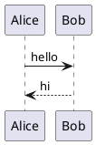

# TypeScript Binding

The `@vgerbot/plantuml` package wraps the Rust core compiled to WASM. It auto-detects the environment and loads the appropriate WASM build.

## Install

```sh
npm install @vgerbot/plantuml
```

## Usage

The API is the same in browser and Node.js:

```typescript
import { renderSvg, renderPreproc } from '@vgerbot/plantuml';

const svg = await renderSvg('@startuml\nAlice -> Bob: hello\nBob --> Alice: hi\n@enduml');
console.log(svg);

const preproc = await renderPreproc('@startuml\n!define FOO bar\nAlice -> Bob: FOO\n@enduml');
console.log(preproc);
```

## How it works

The package ships two WASM targets:

- **`web`** (ES module + `fetch`) — used in the browser. The module's `default()` export initializes the WASM instance.
- **`nodejs`** (`require` + `fs`) — used in Node.js. Auto-initializes on require.

`renderSvg` and `renderPreproc` are async because WASM initialization happens lazily on the first call.

## Rendered example



## Building from source

See [WASM Build](/guides/wasm-build/) for instructions on rebuilding the WASM module with `wasm-pack`.
