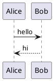

import Playground from '../../components/Playground.astro';

# plantuml.rs

A 100% Rust reimplementation of [PlantUML](https://plantuml.com/) — the Java diagram-generation library — with behavioral parity as the goal, plus language bindings for Java, TypeScript, and Python via FFI.

## Why plantuml.rs?

- **Pure Rust core** — no JVM dependency. Renders diagrams with a native Rust pipeline.
- **Multi-language bindings** — use the same engine from Rust, Java (JNI), TypeScript/JavaScript (WASM), and (planned) Python.
- **Sequence diagrams now** — sequence diagram parsing and SVG rendering are working and tested against the Java reference. More diagram types are being ported incrementally.
- **Preprocessor support** — `!include`, `!define`, variables, and conditionals via the TIM engine.

## Quick example

## Try it now

Head to the [Playground](/playground/) to render diagrams live in your browser using the WASM build — no installation required.

<Playground />

## Next steps

- [Getting Started](/getting-started/) — install and build plantuml.rs
- [Language Reference](/language/) — diagram types and syntax
- [Architecture](/guides/architecture/) — pipeline and crate structure
