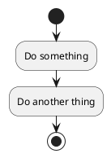
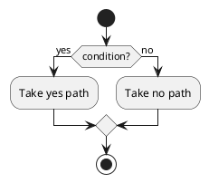
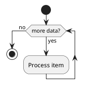

# Activity Diagram

Activity diagrams describe workflows and business processes — sequential and parallel activities, decisions, and flows. plantuml.rs supports the `activitydiagram3` syntax (the beta/new activity diagram).

## Basic flow

Use `start` and `stop` to mark the beginning and end of the flow. Each activity is written as `:label;`.

## If / else

Use `if (condition) then (label)` … `else (label)` … `endif` for branching.

## While loop

Use `while (condition) is (label)` … `endwhile` for iteration.

---

plantuml.rs uses a simplified layout algorithm for this diagram type. Pixel-perfect parity with the Java original is deferred.
