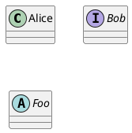
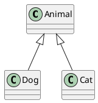
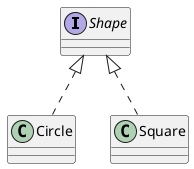
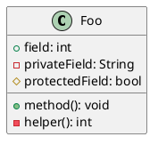

# Class Diagram

Class diagrams describe the static structure of a system — classes, interfaces, attributes, methods, and relationships (inheritance, association, composition, etc.).

## Declaring classes

Declare classes, interfaces, and abstract classes with the corresponding keyword.

## Relationships

Draw relationships between classes with arrow operators: `-->` for association, `--|>` for inheritance, `*--` for composition, `o--` for aggregation.

## Class body

Define fields and methods inside a class body. Use `+` for public, `-` for private, `#` for protected visibility.

plantuml.rs uses a simplified layout algorithm for this diagram type. Pixel-perfect parity with the Java original is deferred.
