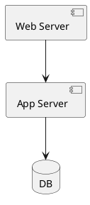
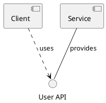
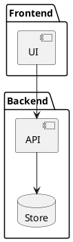

# Component Diagram

Component diagrams describe the components of a system and their dependencies — components, interfaces, ports, and connectors.

## Declaring components

Declare components with the `component` keyword and bracket syntax, or use other element keywords like `database` and `interface`.

## Interfaces

Define provided and required interfaces using `()` or the `interface` keyword, then connect them with `use` or arrows.

## Packages and groupings

Group components inside packages with the `package` keyword.

plantuml.rs uses a simplified layout algorithm for this diagram type. Pixel-perfect parity with the Java original is deferred.
