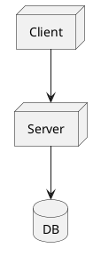
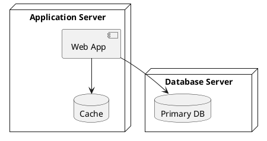
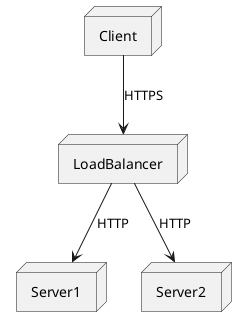

# Deployment Diagram

Deployment diagrams describe the physical deployment of artifacts onto nodes — nodes, artifacts, and communication paths.

## Declaring nodes

Declare nodes with the `node` keyword, and use `database`, `artifact`, or other element keywords for additional deployment targets.

## Nested nodes

Place elements inside a node using braces to show containment.

## Labeled links

Add labels to communication paths to describe the protocol or connection type.

plantuml.rs uses a simplified layout algorithm for this diagram type. Pixel-perfect parity with the Java original is deferred.
