# Gantt

Gantt diagrams describe project schedules — tasks, milestones, dependencies, and time spans. plantuml.rs supports the `@startgantt` / `@endgantt` block syntax.

## Tasks

Define a task with `[Name] lasts N days`. The project start date can be set explicitly.

```plantuml
@startgantt
Project starts the 1st of january 2020
[Task A] lasts 5 days
[Task B] lasts 3 days
@endgantt
```



## Dependencies

Express ordering with `[Task] depends on [Task]`.

```plantuml
@startgantt
Project starts the 1st of january 2020
[Task A] lasts 5 days
[Task B] lasts 3 days
[Task B] depends on [Task A]
@endgantt
```

## Milestones

Milestones mark a single point in time with `[Name] happens at N days`.

```plantuml
@startgantt
Project starts the 1st of january 2020
[Task A] lasts 5 days
milestone [M1] happens at 10 days
@endgantt
```

---

plantuml.rs uses a simplified layout algorithm for this diagram type. Pixel-perfect parity with the Java original is deferred.
