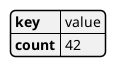
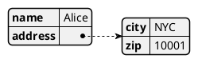
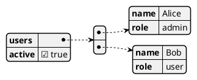

# JSON

JSON diagrams render JSON data structures as a visual tree of nested boxes. plantuml.rs supports the `@startjson`/`@endjson` block containing a raw JSON value.

## Simple object

Place a JSON object between the `@startjson` and `@endjson` markers.

## Nested object

Nested objects and arrays are rendered as deeper levels of the visual tree.

## Array values

Arrays render each element as a child of the enclosing node.

plantuml.rs uses a simplified layout algorithm for this diagram type. Pixel-perfect parity with the Java original is deferred.
