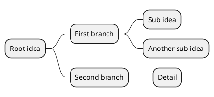
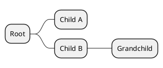
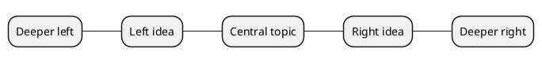

# Mindmap

Mindmaps describe hierarchical trees of ideas radiating from a central concept. plantuml.rs supports the `@startmindmap`/`@endmindmap` block with org-mode style indentation.

## Basic tree

Use asterisk indentation to define the hierarchy. One `*` is the root, two `**` are children, three `***` are grandchildren.

## Plus syntax

Use `+` prefixes instead of `*` for an alternative tree syntax. Each additional `+` deepens the level.

## Left and right branches

Use `--` to grow a branch to the left of the root, and `+`/`*` to grow to the right. This produces a bidirectional mindmap.

plantuml.rs uses a simplified layout algorithm for this diagram type. Pixel-perfect parity with the Java original is deferred.
