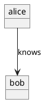

# Object Diagram

Object diagrams describe instances of classes and their relationships at a point in time — objects, links, and attribute values.

## Declaring objects

Declare object instances with the `object` keyword. Optionally specify the class with `: ClassName`.

```plantuml
@startuml
object alice
object bob : User
object carol
@enduml
```

## Links between objects

Connect objects with arrows and optional labels to show links between instances.



## Object attributes

Define attribute values inside an object body.

```plantuml
@startuml
object alice : User {
  name = "Alice"
  age = 30
}
object bob : User {
  name = "Bob"
  age = 25
}
alice --> bob : friend
@enduml
```

plantuml.rs uses a simplified layout algorithm for this diagram type. Pixel-perfect parity with the Java original is deferred.
