# Sequence Diagram

Sequence diagrams are the first — and currently only — fully implemented diagram type in plantuml.rs. This page documents the supported syntax with live examples rendered to SVG at build time.

## Basic messages

Use `->` for a solid arrow and `-->` for a dashed arrow. Participants are inferred from the messages.

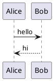

## Declaring participants

Declare participants explicitly to control their left-to-right order. Use `participant`, `actor`, or other keywords.

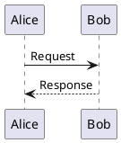

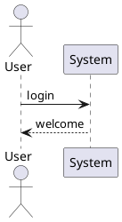

## Self messages

A participant can send a message to itself.

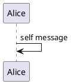

## Notes

Add notes with the `note` keyword. Place them `left of`, `right of`, or `over` a participant.

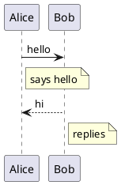

Notes can span multiple participants with `note over`:

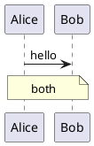

## Activation and deactivation

Use `activate` and `deactivate` to show lifeline activation.

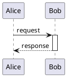

## Grouping

Group messages with `group`/`end`, or use the `alt`/`else`/`end` and `loop`/`end` constructs.

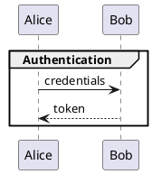

### alt / else

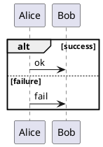

### loop

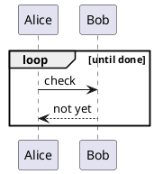

## Dividers

Use `==` to insert a divider between groups of messages.

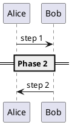

## Automatic numbering

Use `autonumber` to automatically number messages.

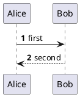

## Title

Set a title with the `title` keyword.

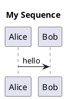

## Styling with skinparam

Customize appearance with `skinparam`. For example, set the background color.

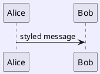

## Colored messages

Specify arrow color inline with `-[#color]`.

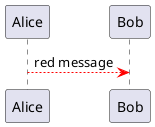
