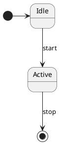
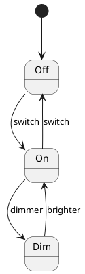
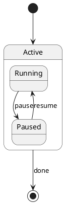

# State Diagram

State diagrams describe the states of an object and the transitions between them — states, transitions, guards, and actions.

## Declaring states

Declare states with the `state` keyword. Use `[*]` to denote the initial and final pseudo-states.

## Transitions with labels

Add labels to transitions to describe the event or condition that triggers them.

## Composite states

Nest states inside a composite state using braces.

plantuml.rs uses a simplified layout algorithm for this diagram type. Pixel-perfect parity with the Java original is deferred.
