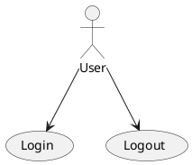
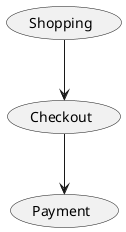
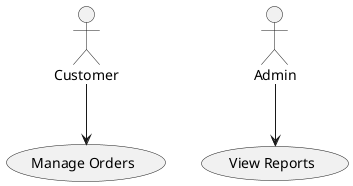

# Use Case Diagram

Use case diagrams describe the interactions between actors and the system — use cases, actors, and their relationships.

## Actors and use cases

Declare actors with `actor` and use cases with `usecase`. Link them with arrows.

## Use case relationships

Use cases can relate to each other with `-->`, `..>`, and other arrow types.

## Multiple actors

plantuml.rs uses a simplified layout algorithm for this diagram type. Pixel-perfect parity with the Java original is deferred.
