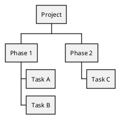
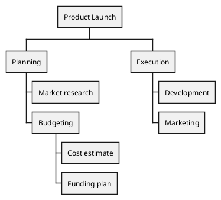
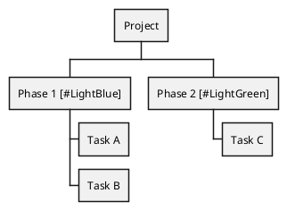

# WBS

Work Breakdown Structure (WBS) diagrams describe a hierarchical decomposition of a project into deliverables and work packages. plantuml.rs supports the `@startwbs`/`@endwbs` block with asterisk-based indentation.

## Basic tree

Use asterisk indentation to define the hierarchy. One `*` is the root project, two `**` are phases, three `***` are tasks.

## Deeper nesting

Add more asterisks to nest further levels of detail.

## Styled nodes

Append a color or style hint in square brackets after a node label to customize its appearance.

plantuml.rs uses a simplified layout algorithm for this diagram type. Pixel-perfect parity with the Java original is deferred.
