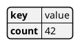
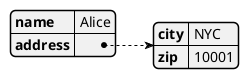
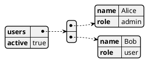

# YAML

YAML diagrams render YAML data structures as a visual tree. plantuml.rs supports the `@startyaml`/`@endyaml` block containing raw YAML content.

## Simple key-value

Place YAML content between the `@startyaml` and `@endyaml` markers.

## Nested mapping

Indent child keys to create nested levels in the visual tree.

## Lists

Use YAML list syntax to render sequence elements as children of the enclosing node.

plantuml.rs uses a simplified layout algorithm for this diagram type. Pixel-perfect parity with the Java original is deferred.
